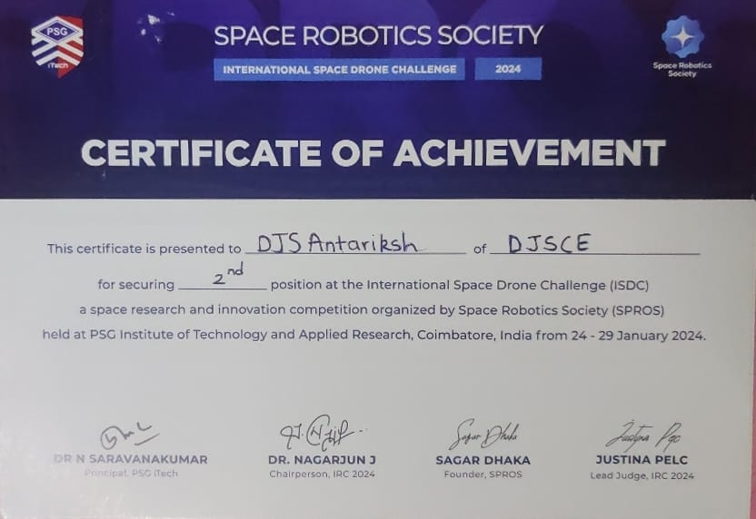

# Certifications and Achievements

## European Rover Challenge 2024
- **Rank**: 1st Rank (India), 2nd Rank (Asia), 11th Rank (Global)
- **Description**: Led a team, as the Vice-Captain, to design and build a mars rover prototype, named Vidyaan, that can navigate challenging terrains and complete various tasks. This event emphasized innovative problem-solving and teamwork in space robotics, and had participants who were currently pursuing their Masters, PhDs or Bachelors.

<!-- [View Certificate](https://your-certificate-link.com) -->

---

## Samsung Solve for Tomorrow 2024
- **Rank**: Top 100
- **Description**: Samsung Solve for Tomorrow is a nationwide education competition that empowers students to use STEM skills to create innovative solutions for real-world community challenges. My team created a solution within the Environnment and Sustainability Track, aiming to solve the Trash and Garbage Problems in India through user involvement, partnerships and government reporting services.

 <!-- Replace with actual image URL -->

---

## College to Corporate - Industry Skills Development Program
<!-- - **Description**: This international event provided a platform to showcase cutting-edge rover technologies. My team’s project was recognized for its technical excellence and practical application in space missions. -->
- **Description**: This is an industry training program organized by DJSCE in collaboration with a MNC.

 <!-- Replace with actual image URL -->

---

## International Rover Challenge 2024
- **Rank**: 3rd Place (Global)
- **Description**: SPROS IRC is a space robotics engineering competition. It challenges university students to conceptualise, design, develop and operate an astronaut-assistive next-generation space Rover and perform specific missions in Mars simulated conditions. I led the team as the Vice-Captain during this competition, upgrading our previous iteration of the Abhyaan Rover.
- **Project**: Abhyaan

 <!-- Replace with actual image URL -->
 <!-- Replace with actual image URL -->

---

## International Space Drone Challenge 2024
- **Rank**: 2nd Place (Global)
- **Description**: SPROS International Space Drone Challenge (ISDC) is a space robotics engineering competition. It challenges university students to conceptualise, design, develop and operate an astronaut-assistive next-generation space drone and perform specific missions in Mars simulated conditions. I led the creation of the Udayaan Drone.

<!--  Replace with actual image URL -->
 <!-- Replace with actual image URL -->

---

## QUESC Paper Presentation
- **Conference**: International Conference on Material Evolutionary Computing and Networks (ICECMSN 2023)

<!--  Replace with actual image URL -->
 <!-- Replace with actual image URL -->

---

## Amazon ML Summer School 2023
- **Description**: Amazon ML Summer School 2023 is an integrated learning experience that will helped learn about key machine learning (ML) topics. The curriculum covered the fundamental concepts while linking them to practical industry applications through an immersive experience.

<!--  Replace with actual image URL -->
 <!-- Replace with actual image URL -->

---

## ICACTA Volunteer
- **Description**: Volunteered in the Finance Team of ICACTA 2023, an international conference conducted by Dwarkadas J. Sanghvi College of Engineering.

<!--  Replace with actual image URL -->
 <!-- Replace with actual image URL -->

---

## European Rover Challenge 2023 On-site
- **Rank**: 1st Rank (India), 2nd Rank (Asia), 10th Rank (Global)
- **Description**: ERC is an exciting competition where student teams build advanced rovers inspired by NASA and ESA missions. They compete for the chance to test their designs in the Marsyard and present their work to a global audience. Our project was named Abhyaan and we were the first Indian Team to qualify and participate in the on-site finals held in Kielce, Poland.

<!--  Replace with actual image URL -->
 <!-- Replace with actual image URL -->

---

## European Rover Challenge 2023 Remote
- **Rank**: 2nd Rank (Global)
- **Description**: ERC Remote is an exciting competition where student teams create software systems to operate a common rover and robotic arm to perform tasks inspired by NASA and ESA missions. We were the first team to have podium finishes for 4 consecutive years.

<!--  Replace with actual image URL -->
 <!-- Replace with actual image URL -->

---

## International Rover Challenge 2023
- **Rank**: 8th Rank (Global)
- **Description**: ERC Remote is an exciting competition where student teams create software systems to operate a common rover and robotic arm to perform tasks inspired by NASA and ESA missions.

 <!-- Replace with actual image URL -->

---

### Summary
I have had the opportunity to represent my work internationally, from competitions in space robotics to research conferences. These experiences have enriched my understanding of technology and its potential impact on the world.

---