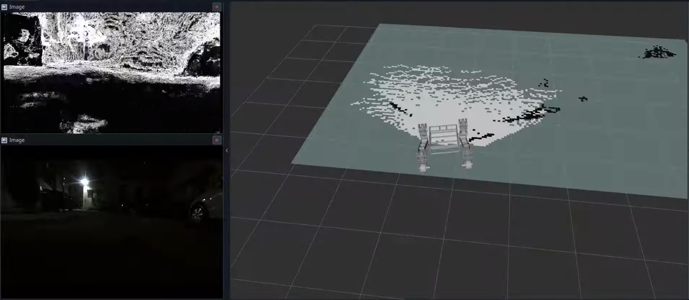
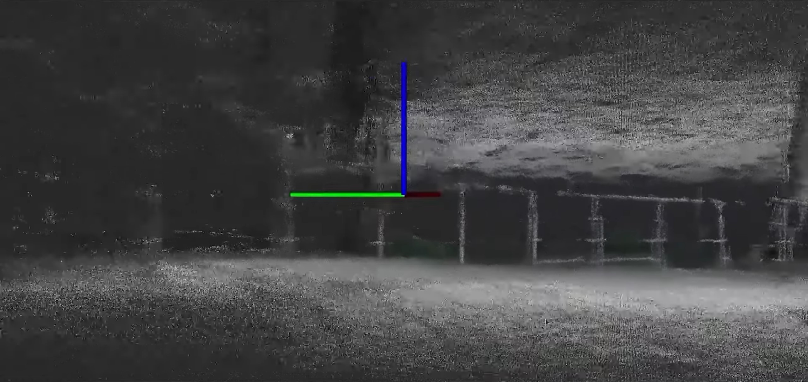
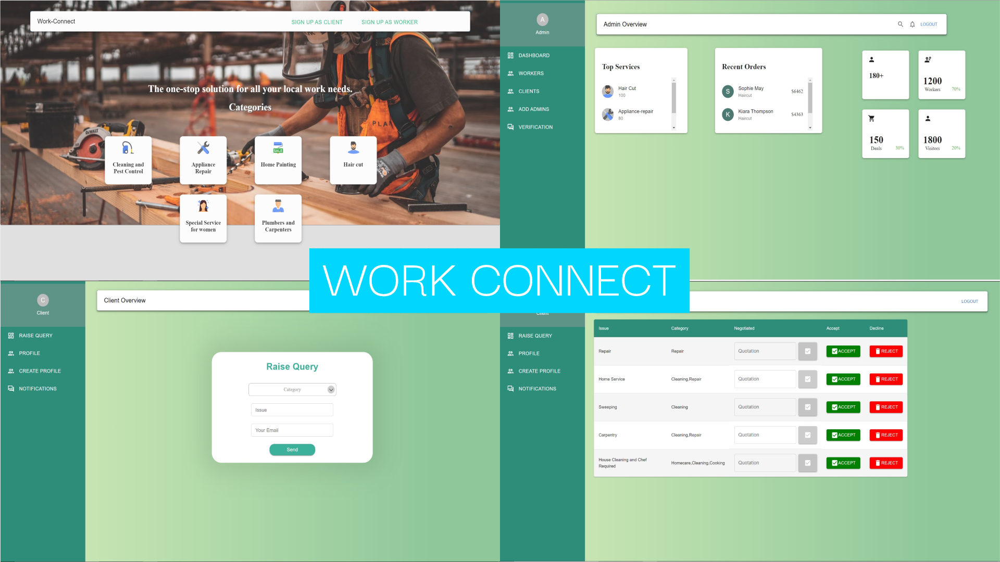
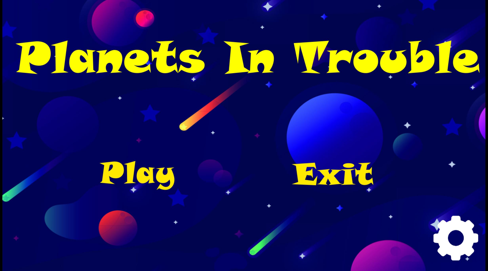

# Projects

---

## Autonomous Drone for Flood Management

**Overview**: Researched and developed an autonomous drone system designed to assist in post-flood search and rescue operations. The drone employs a Pixhawk flight controller with integrated RGB cameras and GPS modules to streamline navigation and execute efficient mission planning and victim location reporting.

**Key Features**:
- **Pixhawk and PX4 Autopilot Integration**: Ensures precise control and autonomous flight capabilities.
- **GNSS-Based Navigation**: Utilizes GPS and EKF systems for navigation.
- **Dual-Model Computer Vision System**: Utilizes YOLOv8 and DETR-ResNet50 for aerial house detection and human detection in flood scenarios.
- **Specialized Dataset Enhancement**: Combined and annotated specialized datasets for tiny person detection in disaster scenarios.

**Technologies**: Pixhawk, GPS, YOLOv8, DETR-ResNet50, OpenCV, Python, ROS, Tensorflow

[This is a private research project]()

---

## Vidyaan – Autonomous Rover

**Overview**: Designed and implemented a robust autonomous navigation system featuring a custom hardware control architecture for precise, multi-level navigation.

**Key Features**:
- **Multi-Level Navigation**: Integrated A*, DWA, and RTABMap SLAM for effective path planning and obstacle avoidance.
- **Dual-Mode Control**: Manual mode with joystick control, emergency stop, and autonomous mode with hardware acceleration limits.
- **Comprehensive Diagnostics**: Motor current monitoring, encoder sanity checks, and emergency stop verification.

**Technologies**: ROS, Jetson, Python, C++, OpenCV, Gazebo, RViz, SLAM, RTabmap, Arduino

---

## Autonomous Navigation System for Vehicles

**Overview**: Developed a Visual SLAM-based autonomous navigation system using stereo vision to provide real-time feature detection, 3D point cloud reconstruction, and vehicle localization.

**Key Features**:
- **Modified A* Path Planning**: Implemented an algorithm that accommodates Ackermann steering geometry, ensuring continuous curvature paths.
- **Motion Planning Pipeline**: Combines local trajectory optimization with global path planning for navigating dynamic environments.

**Technologies**: ROS, Jetson, Python, C++, OpenCV, Gazebo, PCL, Eigen

---

## A.I.V.A – Cross-Platform Voice Assistant

**Overview**:  Built a cross-platform voice assistant that utilizes advanced NLP techniques for intent recognition and task automation on both desktop and mobile devices.

**Key Features**:
- **Context-Aware Conversation Management**: Incorporates dialogue state tracking and custom API integrations for functionalities like email and call services.
- **Custom API Integrations**: Supports search queries and task management across different devices.
- **Fine-tuned LLM usage**: Utilises Decision Trees for Intent Recognition, Gemini for Response Framing, WhisperX for Voice Input, ElevenLabs for Vocal Response, PyGame for Desktop App Creation and a Siamese Network for Voice Authentication for sensitive tasks.

**Technologies**: Python, Node.js, Flask, Gemini, WhisperX, PyGame, Scikit-learn, Tensorflow, AWS

[Link to the Github Repository](https://github.com/Innomer/Codeshastra_TechTitans/)

---

## QUESC

**Overview**:  Conducted research on applying Quantum Machine Learning (QML) for sound classification to improve performance and accuracy in processing audio data.

**Key Features**:
- **Hybrid Model**: Introduces a Quantized Hybrid Quantum-Classical Neural Network (QQNN) for environmental sound classification, combining classical and quantum layers to leverage quantum computing's advantages.
- **Quantization for Edge Devices**: Employs quantization to reduce memory usage significantly, enabling compatibility with edge devices and making the model efficient for real-time applications.

**Technologies**: Qiskit, Pennylane, Tensorflow, Librosa, Python

[Link to the Github Repository](https://github.com/Innomer/QUESC_Research_Paper)

---

## 3D Model Generation from Text Prompts

**Overview**:  Explores openly available techniques to convert text prompts to 3D Models.

**Key Features**:
- **Text-to-3D Generation**: Implements multiple models, including Shap-E and Stable Diffusion, for converting text prompts into 3D models.
- **Depth-to-3D Mapping**: Explores using depth maps generated by Deep Learning Models to generate 3D Models.

**Technologies**: Python, NeRF, MiDaS, Stable Diffusion, PyTorch, Streamlit

[Link to the Github Repository](https://github.com/Innomer/3D-Model-Generation-from-Prompt)

---

## Car Detective

**Overview**:  Developed a computer vision-aided web application to predict car prices based on various features and images. Detects damages using pre-trained models and regression techniques to provide accurate pricing and condition assessments.

**Key Features**:
- **Price Prediction Model**: Utilizes advanced regression techniques to estimate car values based on visual and categorical data.
- **Damage Detection**: Employs fine-tuned pre-trained computer vision models like ResNet and VGG to identify and highlight damages in car images, improving accuracy in pricing.

**Technologies**: Python, Flask, React.js, MongoDB, Tensorflow, Scikit-learn

[Link to the Github Repository](https://github.com/Innomer/CarDetective/tree/main)

---

## VerifyU

**Overview**:  Built a web application that enables users to create personalized Digital Identity Cards by uploading government-related documents. To enhance privacy, access to documents requires both the Digital Identity Card and facial recognition authentication.

**Key Features**:
- **OCR and Verification**: Processes and verifies uploaded government documents to ensure authenticity.
- **QR Code Generation**: Hashes document details into a unique QR code, providing users with a secure digital identity.
- **Dual-Layer Security**: Requires both the QR-based Digital Identity Card and facial recognition for access to stored documents.

**Technologies**: Python, Django, React.js, Node.js, OpenCV, Tensorflow, PaddleOCR

[Link to the Github Repository](https://github.com/Innomer/LOC_Console.io)

---

## Work-Connect

**Overview**: Developed a web platform to connect local workers with clients seeking solutions to specific problems.

**Key Features**:
- **Client-Worker Matching**: Allows clients to post problems and workers to provide quotes, establishing a one-on-one connection.
- **Quotation Management**: Clients can review, accept, or reject quotes, providing transparency and control over the selection process.
- **Enhanced Communication**: Facilitates seamless interaction between clients and workers, optimizing decision-making for both parties.

**Technologies**: Node.js, React.js

[Link to the Github Repository](https://github.com/Innomer/Console.IO_WebDevelopment_Rookies)

---

## Planets in Trouble

**Overview**: Developed A 2D Android Game made using the Unity Game Engine wherein the player needs to keep the planets from colliding using only a single finger.

**Key Features**:
- **Simple Controls**: Players can control planet movements using intuitive single-finger gestures, making the game accessible and easy to play.
- **Dynamic Gameplay**: Features increasingly challenging levels where the speed and number of planets increase, requiring quick reflexes and strategic planning.
- **Vibrant Graphics and Sound**: Utilizes colorful visuals and engaging sound effects to enhance the overall gaming experience.

**Technologies**: Unity Game Engine, C#

[Link to the APKs](https://github.com/Innomer/PL-Game-APks)

---